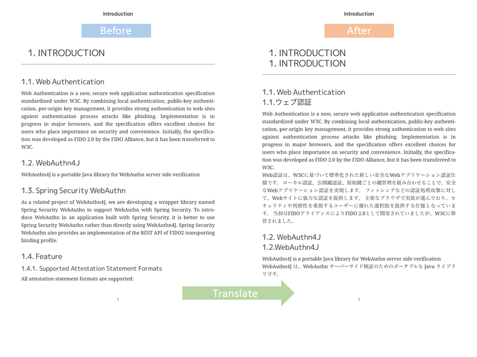

# epub-translator 

[](https://github.com/sharplab/epub-translator/actions)

epub-translator is an utility to translate EPub books.

- Utilize [DeepL API](https://www.deepl.com/ja/docs-api/) (You need to register DeepL API plan)
- Leave the original text for reference, and insert the translated text below per paragraph



This project uses Quarkus, the Supersonic Subatomic Java Framework.
If you want to learn more about Quarkus, please visit its website: https://quarkus.io/ .

## Build

### Prerequisites

- JDK 11
- GraalVM (If you want to build a native image directly)
- Docker or Podman (If you want to build a native image in a container)

### Building

The application can be built and executed directly from the source dir using

```
./gradlew build
java -jar build\quarkus-app\quarkus-run.jar --src my.epub
```

### Creating an uber-jar


The application can be packaged using following command:

```
./gradlew quarkusBuild -Dquarkus.package.type=uber-jar
```

It produces the `epub-translator-runner.jar` file in the `build` directory.

<!-- native build is temporary disabled
### Creating a native executable

You can also create a native executable in this way:
```
 ./gradlew build -Dquarkus.package.type=native
```

Or, if you don't have GraalVM installed, you can run the native executable build in a container using following command:
```
./gradlew build -Dquarkus.package.type=native -Dquarkus.native.container-build=true
```

It produces the `epub-translator-runner` file in the `build` directory.
-->

## Configuration

place application.yml to `<epub-translator working directory>/config/application.yml`

#### application.yml

```
ePubTranslator:
  deepL:
    apiEndpoint: https://api.deepl.com # If you subscribe free API plan, use "https://api-free.deepl.com" instead.
    apiKey: <put your api key here>
  language:
    source: en        # default source language
    destination: ja   # default destination language

```

## Execution

uber-jar

```
java -jar epub-translator-runner.jar --src <path to source epub file> [--dst <path to destination epub file>] \
[--srcLang <source language>] [--dstLang <destination language>]
```

<!--
executable

```
./epub-translator-runner --src <path to source epub file> [--dst <path to destination epub file>] \
[--srcLang <source language>] [--dstLang <destination language>]
```
-->

## Database and DeepL limited credits

A database is kept of previous translations. This is especially useful if a translation fails during processing, to avoid spending credit on already translated content. 
It also makes it possible to incrementally translate a book using limited credits, by running the translation again later when more credits are available

The database is located at `~username/.epub-translator`.

`epub-translator` can count the characters in the file using `--count`. 
This can be used to estimate the cost in DeepL credits before executing the translation. 

## Fixing bad output files

If the translated epub is not readable by your e-reader, it may be fixable by [Calibre](https://calibre-ebook.com/).
Calibre has an eBook conversion tool, and converting the output book from epub to epub tends to fix the problems.  
